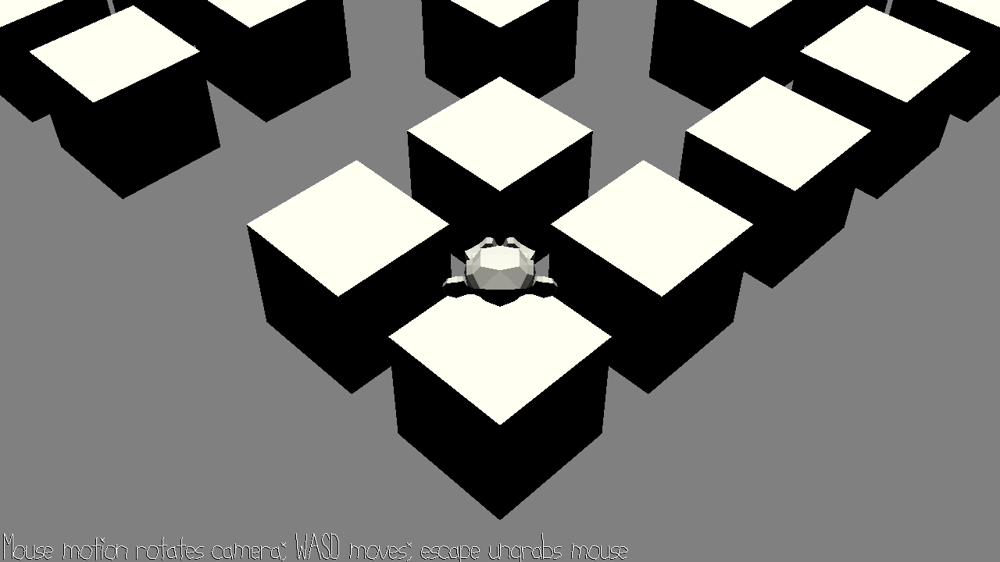

# Monkey Jump

Author: Wenxuan Ou

Design: The game terrain changes with music rhythm.

Screen Shot:

How To Play:

WASD for forward, backward, turn left, and turn right. Mouse to adjust camera.

Sources: Monkey comes from Blender build-in asset. Music from base code.

This game was built with [NEST](NEST.md).

